# 更多自动科研论文图像参考

新增 8 篇论文的 12 张参考图，已核对原文图号与主要原图。STORM 属于文献调研/写作相邻方向。图片为原作者图像的本地阅读副本，部分经缩放；DGM Fig. 3 拼合左右两个原始面板。图的组织方式可供参考，原论文结论与机制不能直接套用到 SURE-Evolve。

[打开图集：分类筛选、放大、原文链接](../assets/figure_survey/more/index.html)

## 01. AlphaEvolve · Figure 2：模块颜色与代码对应

上层放用户提供的初始程序、评估代码和配置；中层把采样、生成、评估、归档拆成四个同级模块；下层放控制循环。适合借鉴模块层级及颜色映射，SURE 总图可把伪代码区换成按轮执行流程。

[论文原图与图注](https://arxiv.org/html/2506.13131v1#S2.F2) · [打开图片](../assets/figure_survey/more/alphaevolve_fig2.jpg)

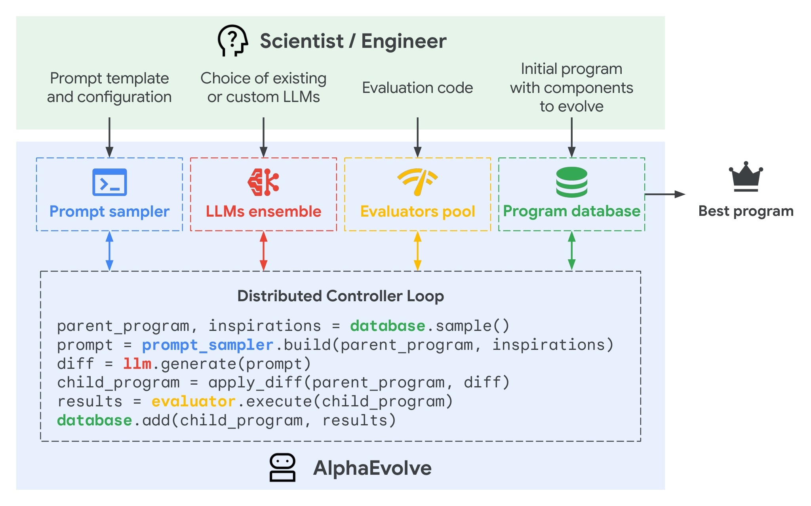

## 02. DeepEvolve · Figure 1：用一张图讲研究带来的变化

上半部画纯进化的轨迹，下半部画加入深度研究后的候选谱系，并把关键想法、分数和性能跳跃连接起来。适合 SURE 的实例分析；其中比较结论属于原论文，不能直接作为 SURE 的实验结论。

[论文原图与图注](https://arxiv.org/html/2510.06056v1#S1.F1) · [打开图片](../assets/figure_survey/more/deepevolve_fig1.jpg)

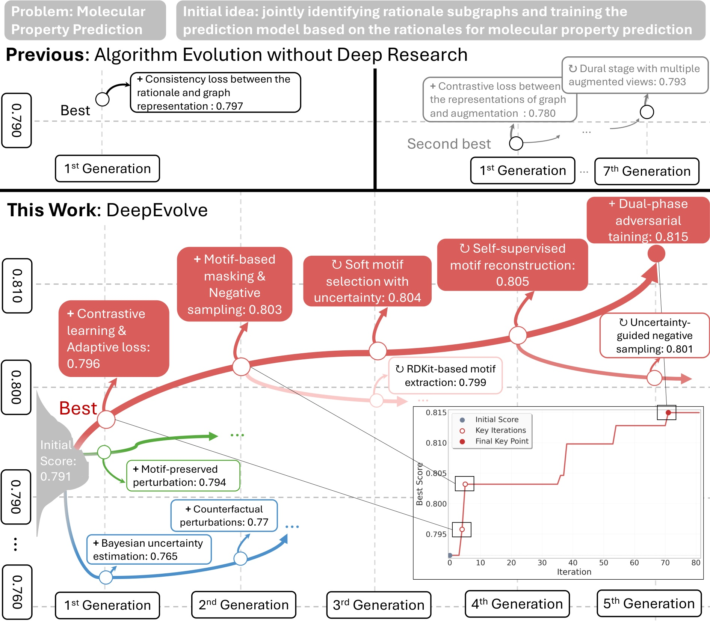

## 03. DeepEvolve · Figure 2：研究与进化组成双侧循环

左侧黄色为 Planning、Searching、Writing；右侧蓝色为 Coding、Evaluation、Evolutionary Database；中央为协调器。最适合参考 SURE 的 XLab 研究侧与实验执行侧。岛屿、MAP-Elites 不是 SURE 当前机制，应按实际方法替换。

[论文原图与图注](https://arxiv.org/html/2510.06056v1#S3.F2) · [打开图片](../assets/figure_survey/more/deepevolve_fig2.jpg)

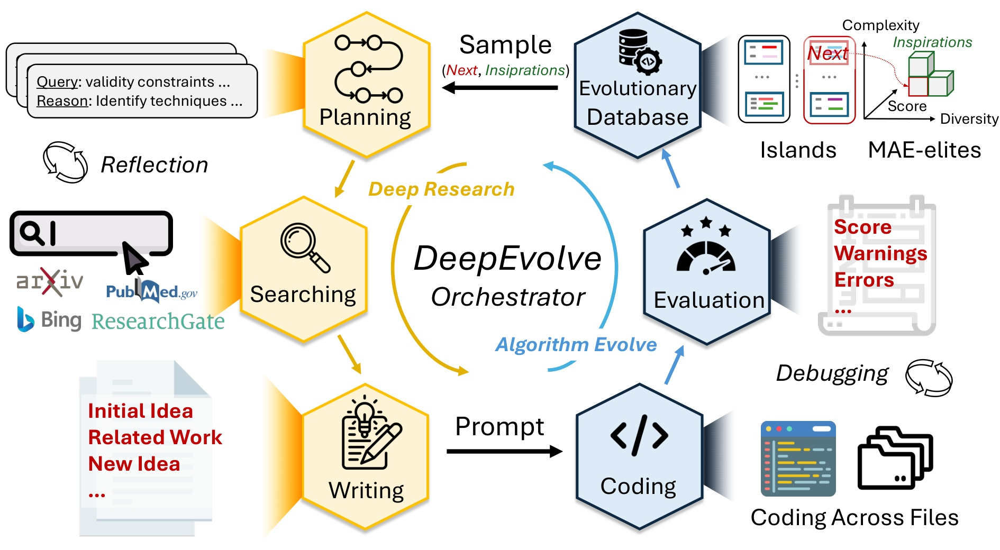

## 04. DeepEvolve · Figure 5：跨任务使用统一形式的小面板

每个任务单独一个分数—迭代曲线，标出初始分数、改进点与最终最优值。适合 ASR/TTS/SD 分面，保留各自指标和方向；不要将不同指标原始值混为同一个刻度。

[论文原图与图注](https://arxiv.org/html/2510.06056v1#S4.F5) · [打开图片](../assets/figure_survey/more/deepevolve_fig5.jpg)

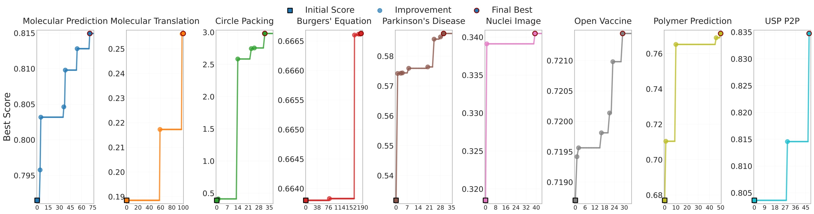

## 05. Darwin Gödel Machine · Figure 1：把最重要的两个动作画大

粗环连接 Self-modify 与 Evaluation，左边接 Archive，右边放两步操作的局部展开。可借鉴主次层级；它进化的是智能体自身代码，SURE 当前主要进化模型结构，图中对象须明确区分。

[论文原图与图注](https://arxiv.org/html/2505.22954v1#S1.F1) · [打开图片](../assets/figure_survey/more/dgm_fig1.jpg)

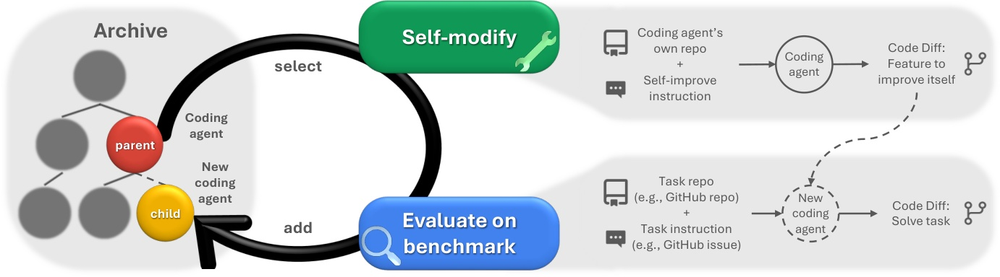

## 06. Darwin Gödel Machine · Figure 3：候选谱系与性能曲线互相解释

左边节点树用填色表达分数、边框表达评测范围；右边并排展示平均、历史最优和最终赢家祖先路径，给关键节点加机制标签。此处合并原图左右两幅供对照。SURE 谱系应依照真实轮次和父方案生成。

[论文原图与图注](https://arxiv.org/html/2505.22954v1#S4.F3) · [打开图片](../assets/figure_survey/more/dgm_fig3.jpg)

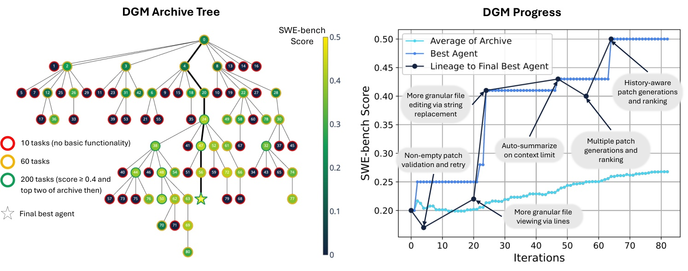

## 07. AgentRxiv · Figure 3：研究成果通过中央仓库被复用

两侧分别是读取与上传研究的实验室，中间是研究论文库，用查询和 PDF 产物连接。适合参考研究记忆的流向；像素人物适合演示稿，论文可改为简洁模块。

[论文原图与图注](https://arxiv.org/html/2503.18102v1#S3.F3) · [打开图片](../assets/figure_survey/more/agentrxiv_fig3.jpg)

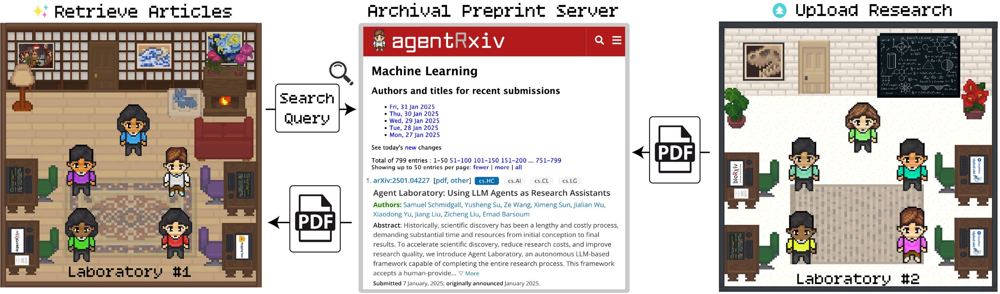

## 08. AgentRxiv · Figure 4：在阶梯曲线上标注发现了什么

横轴是生成论文数，每个新高点用引线连接方法名称；背景色带和虚线标示不同基线。适合把 SURE 性能跳跃与结构想法对应。原图标的是 test accuracy；SURE 过程曲线应使用 search 指标，holdout 只作最终报告。

[论文原图与图注](https://arxiv.org/html/2503.18102v1#S3.F4) · [打开图片](../assets/figure_survey/more/agentrxiv_fig4.jpg)

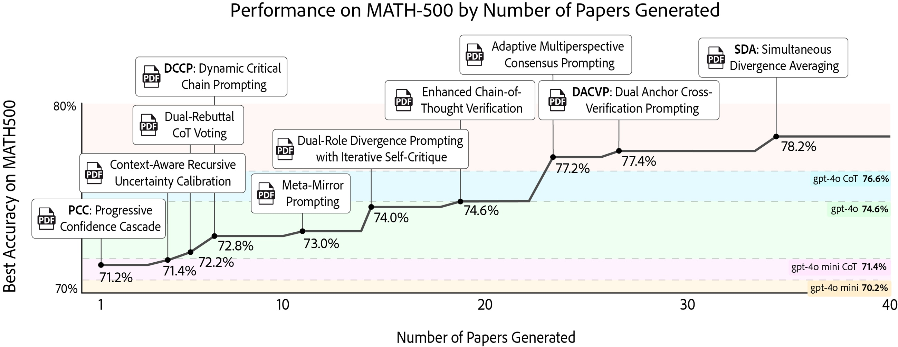

## 09. ResearchAgent · Figure 1：知识来源与想法形成上下分层

上层放论文、引用关系图和实体知识库；下层是问题识别、方法设计、实验设计与反馈修订。适合解释 XLab 文献证据如何进入结构候选；论文关注 idea 生成，不代表完整实验执行。

[论文原图与图注](https://arxiv.org/html/2404.07738v1#S1.F1) · [打开图片](../assets/figure_survey/more/researchagent_fig1.jpg)

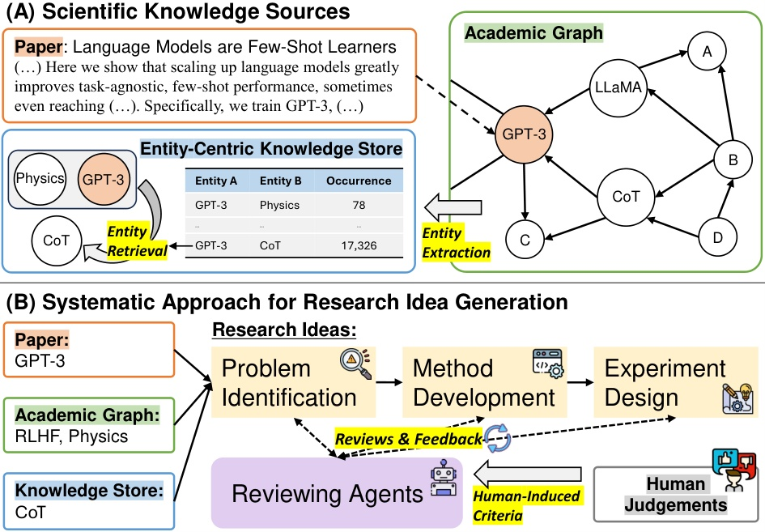

## 10. R&D-Agent · Figure 1：研究区与开发区用反馈连接

左边研究、知识和多路探索，右边开发、调试、运行；候选用绿/粉区分改进与未改进。适合 SURE 的研究—执行职责分区。原图的采样调试、提前停止和融合不能直接视为 SURE 的搜索协议。

[论文原图与图注](https://arxiv.org/html/2505.14738v1#S2.F1) · [打开图片](../assets/figure_survey/more/rdagent_fig1.jpg)

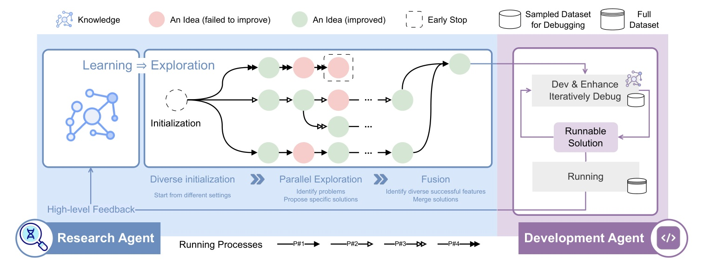

## 11. MLE-STAR · Figure 2：三个横向面板展开局部优化

(a) 检索和初始化；(b) 消融定位重要代码块；(c) 按历史反馈修订代码块，标明内外两层循环。适合借鉴“整体流程—局部修改”的分层表达，当前 SURE 不能照搬其消融定位算法。

[论文原图与图注](https://arxiv.org/html/2506.15692v1#S2.F2) · [打开图片](../assets/figure_survey/more/mle_star_fig2.jpg)

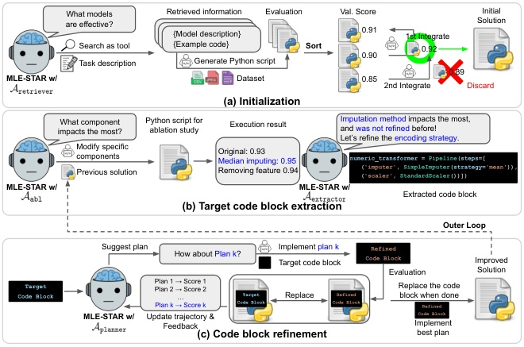

## 12. STORM · Figure 2：用产物和编号串起调研过程

相关文献、多视角提问、检索专家、对话、提纲和引用，通过编号步骤连接。它属于有依据的长文写作相邻方向；这里借鉴文献调研子流程，不能当成实验驱动自动科研系统。

[论文原图与图注](https://arxiv.org/html/2402.14207v2#S3.F2) · [打开图片](../assets/figure_survey/more/storm_fig2.jpg)

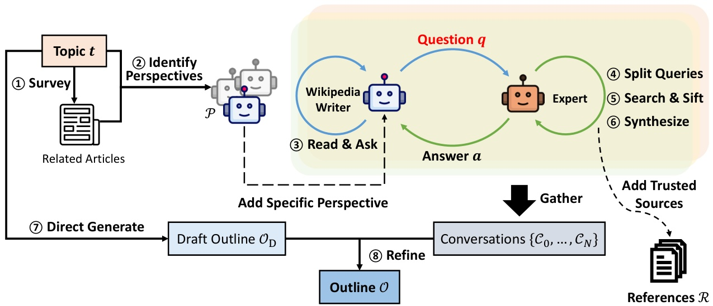
