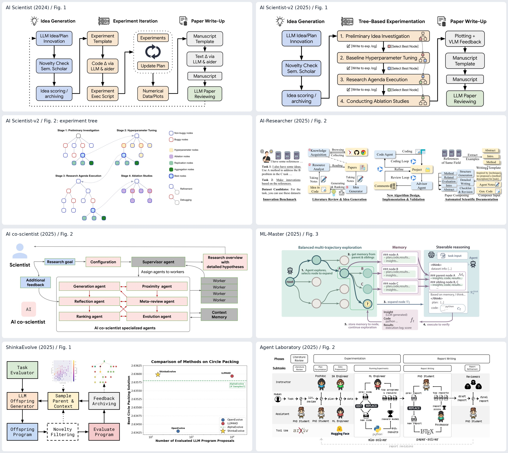
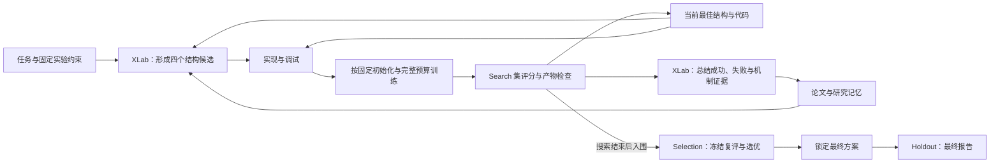
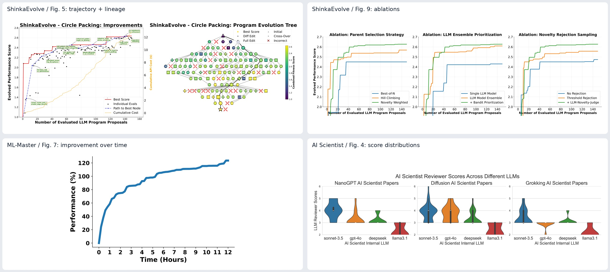

# 自动科研论文画图调研：SURE-Evolve 的参考方案

调研日期：2026-09-11。选取 8 篇 2024–2025 年代表性论文，核对 arXiv v1 原文、图注和主要方法原图；图号统一对应下文链接的版本。这是面向本项目的选例分析，不是穷尽式文献综述。原图拼板只作阅读对照，图像归原作者所有；对 SURE-Evolve 的布局和实验建议是本次分析，不是已有实验结论。

最值得组合参考的是 **AI Scientist-v2 的阶段总览 + ML-Master 的记忆反馈机制 + ShinkaEvolve 的演化过程证据**。这三者分别回答：系统如何完成研究、历史实验如何改变下一步决策、持续迭代是否带来实际收益。

[方法原图拼板](../assets/figure_survey/methods_board.jpg) · [实验结果原图拼板](../assets/figure_survey/evidence_board.jpg)

补充：[第二批图集：新增 8 篇论文、12 张可放大参考图](automated_research_figure_gallery.md) · [网页浏览版](../assets/figure_survey/more/index.html)

## 1. 八篇论文具体怎么画

| 论文 | 重点图号与原文 | 原图的组织方式 | 对 SURE-Evolve 的借鉴 |
| --- | --- | --- | --- |
| The AI Scientist（2024） | [Fig. 1](https://arxiv.org/html/2408.06292v1#S1.F1)、[Fig. 4](https://arxiv.org/html/2408.06292v1#S6.F4) | Fig. 1 横向三大区：想法生成、实验迭代、论文写作；区内纵向步骤，底部虚线回路。蓝色表示想法、浅橙表示实验、灰色表示写作、绿色表示审稿。Fig. 4 用按领域分面的 violin plot 表示不同模型生成论文的评分分布。 | 借鉴三个大区和少量语义色。最终产物按本项目改成经验证的模型和研究证据；论文写作不能直接照搬成已实现能力。 |
| The AI Scientist-v2（2025） | [Fig. 1](https://arxiv.org/html/2504.08066v1#S2.F1)、[Fig. 2](https://arxiv.org/html/2504.08066v1#S3.F2) | 延续三大区，把中间实验过程展开为四阶段；另用 2×2 树图说明初步实验、调参、研究议程、消融。节点颜色表示有效、报错、复现、聚合等状态，连线区分改进和调试。 | 借鉴“总览图 + 局部机制展开”和节点状态编码。其树搜索、调参阶段不对应 SURE 当前搜索协议，不能原样套用。 |
| AI-Researcher（2025） | [Fig. 1](https://arxiv.org/html/2505.18705v1#S1.F1)、[Fig. 2](https://arxiv.org/html/2505.18705v1#S3.F2)、[Fig. 3](https://arxiv.org/html/2505.18705v1#S3.F3) | Fig. 1 先讲端到端能力；Fig. 2 从输入到文献、idea、实现与验证、论文生成，横向展示完整架构；Fig. 3 再展开实现迭代和文档生成。使用浅色模块、文件和工具图标、局部反馈回路。 | 适合解释文献如何变成可执行研究规格。其总图文字和图标较密，短篇论文宜进一步精简。 |
| Towards an AI co-scientist（2025） | [Fig. 1](https://arxiv.org/html/2502.18864v1#S1.F1)、[Fig. 2](https://arxiv.org/html/2502.18864v1#S3.F2)、[Fig. 4](https://arxiv.org/html/2502.18864v1#S4.F4) | Fig. 1 组合系统设计与生物医学验证；Fig. 2 将研究者输入、Supervisor、六类 Agent、worker 和记忆组织为分层架构。灰箭头表示信息流，红箭头强调反馈。Fig. 4 展示随时间桶变化的 best/top-10 Elo。 | 可以借鉴反馈箭头的突出方式、目标与研究记忆的位置。Elo 是系统自动评估分数，不能等同于外部实验真值；SURE 应优先展示可信评测器产生的任务指标。 |
| ML-Master（2025） | [Fig. 3](https://arxiv.org/html/2506.16499v1#S3.F3)、[Fig. 5](https://arxiv.org/html/2506.16499v1#S3.F5)、[Fig. 7](https://arxiv.org/html/2506.16499v1#S4.F7.fig2) | Fig. 3 左边是探索树，中间是 Memory 卡片，右边是推理与代码生成；反馈绕回搜索节点。Fig. 5 展开记忆如何进入推理。Fig. 7 用时间—性能改进曲线说明持续探索收益。 | 与本项目“实验结果→总结→下一轮 idea”最接近。把论文证据和实验总结画成可见卡片，并明确它们如何进入下一轮；不照搬 MCTS。 |
| ShinkaEvolve（2025） | [Fig. 1](https://arxiv.org/html/2509.19349v1#S0.F1)、[Fig. 5](https://arxiv.org/html/2509.19349v1#S4.F5)、[Fig. 9](https://arxiv.org/html/2509.19349v1#S5.F9) | Fig. 1 左边是程序生成、评估、归档和父代采样闭环，右边直接放效果—评估次数对比。Fig. 5 左边叠加单候选分数、历史最优轨迹、关键改动标签及累计费用，右边画真实演化树。Fig. 9 用三个并排曲线面板做机制消融。 | 最值得借鉴“过程曲线 + 候选谱系 + 关键机制标签”。SURE 的完整训练成本较高，还应单独报告 accelerator-hours；不要只按候选数宣称计算效率。 |
| AIDE（2025） | [Fig. 1](https://arxiv.org/html/2502.13138v1#S3.F1)、[Fig. 4](https://arxiv.org/html/2502.13138v1#S4.F4) | Fig. 1 是极简解空间树：每个节点为一份 Python 程序，边直接标 draft/fix/improve；深灰表示报错、浅色表示有效、醒目色表示最优。Fig. 4 展示 AI R&D 任务中的时间—平均分数比较。 | 学习其“一种节点、一种状态图例、边上一个动作”的表达。很适合给 SURE 的候选谱系减负。 |
| Agent Laboratory（2025） | [Fig. 2](https://arxiv.org/html/2501.04227v1#S3.F2)、[Fig. 3](https://arxiv.org/html/2501.04227v1#S3.F3)、[Fig. 6](https://arxiv.org/html/2501.04227v1#S4.F6) | Fig. 2 用泳道/矩阵布局：横向为研究阶段，纵向为子任务、角色和工具。Fig. 3 专门展开代码生成、执行、评分、自反思和优秀程序池。Fig. 6 用分裂小提琴等面板比较人工与自动评分。 | 多角色协作是论文贡献时可借鉴泳道；当前 SURE 更适合突出研究与执行两侧的接口，不必堆人物头像。 |

## 2. 这些图的共同设计规律

1. **总图先给阅读顺序。** 常见的是横向 3–4 个大区，各区内部纵向展开；图标只辅助定位，主叙事依靠阶段、产物和箭头。
2. **把创新机制画大。** AI Scientist-v2 放大实验树，ML-Master 放大记忆与推理连接，ShinkaEvolve 放大程序演化闭环。模块面积应与论文贡献的重要程度匹配。
3. **反馈必须说明传递内容。** 优秀的表达会出现分数、错误信息、代码、经验摘要等产物，而不只是一个没有标签的回环箭头。
4. **总览与机制分层。** Fig. 1/2 负责全貌，后续图解释树搜索、实现修正、记忆等细节。短篇论文可以合并为一个有子面板的跨栏图。
5. **实验图跟主张对应。** 持续改进用时间或评估次数曲线；样本效率用预算—效果图；评分可靠性用人工/自动评分比较；不同任务表现用分面或表格。
6. **语义色优先于装饰。** 浅色区块、深色文字、细边框很普遍；错误状态、最优节点及反馈回路使用少量强调色。不是所有论文都简洁，例如 AI-Researcher 的总图在小尺寸下就较拥挤。

## 3. SURE-Evolve 当前应该表达什么

以 [当前多任务说明](sure_master_multitask.md)、[ordinary ASR 配置](../../configs/sure_master/ordinary-asr-cuda.yaml) 和 [控制器实现](../../playground/sure_master/core/playground.py) 为准。旧 XLab 接入设计里保留的 staged axes、短训漏斗等内容已经不适合作为当前方法图依据。

- 搜索为 `ordinary`，XLab 负责 idea 生成和每轮结果总结。
- 每轮基于冻结的当前最佳代码提出四个结构候选。
- 当前范围为 `architecture_only`，训练方法、预算和推理设置固定。
- 候选按指定初始化来源完成完整搜索训练预算；不把跨轮连线画成 checkpoint 累积续训。
- 成功、失败和指标反馈都进入总结，随后再生成下一批。
- 搜索结束，当前实现对 baseline 和按 search 分数入围的最多两个候选做冻结 selection；再对 baseline 与选中方案做 holdout 报告。若选中 baseline，则不重复评测同一方案。
- holdout 没有返回搜索或再次选优的箭头。

这里的主要进化对象是被研究的模型结构和研究方案。EvoMaster 的另一个 `--evolve` skill/prompt 包装层是不同机制；若正式实验未启用它，不应把它混入本方法图。

## 4. 推荐的一组论文图

**图 1：研究—实验闭环总览，跨双栏。**

布局借鉴 AI Scientist-v2，反馈机制借鉴 ML-Master。左侧放任务、基线、文献与历史知识；中间给研究和实验两个大区；右侧放独立选优、冻结产物、holdout 指标。底部的经验反馈是最醒目的返回路径。

上图只表达拓扑。最终排版时，把“研究区”设为浅蓝、“实验区”设为浅橙、“评测区”设为浅绿，“记忆卡片”设为浅紫。控制主要模块在 8–10 个左右，训练验证等次级细节放进实验模块内部或图注。

可用英文图注草案：

> Overview of SURE-Evolve. Literature-grounded research proposes four architectural candidates per round under fixed training and inference settings. Candidates are implemented, trained under the prescribed initialization and full training budget, and evaluated on the search split. Experimental outcomes, including failures, inform the next research round. Finalists are evaluated on a separate selection split, and the selected model is frozen before holdout reporting.

**图 2：跨任务改进与搜索效率，三个任务小面板。**

- ASR、TTS、SD 各占一个面板，原始 WER/CER/DER 分开作图并注明越低越好；不要直接平均三个指标。
- 横轴可以用累计完成的候选评估数，纵轴为 search 集历史最优指标；用细散点保留每个有效候选的实际分数。
- baseline 用水平虚线；正式对照应匹配搜索空间、LLM 和训练预算。独立采样、无跨轮反馈等只是拟议消融，不代表仓库已有对应运行模式。
- 计算效率要补充累计 accelerator-hours 或 wall-clock。不同设备和架构的耗时不可由“每轮四个候选”直接推断；失败和重试消耗也应计入。
- 多次独立搜索时，显示均值与清楚定义的误差区间；只有一次运行就展示单次轨迹，不制造误差带。
- 曲线用 search 数据；最终表格单独报告 selection 选出方案的 holdout 分数，不能按每轮 holdout 成绩挑最好结果。

**图 3：研究反馈到底带来了什么，消融或实例轨迹。**

若主张是“反馈驱动研究优于独立生成”，优先做配对消融：完整系统、去跨轮实验反馈、去文献证据。每个对照需在相同候选数量和训练协议下运行；文献与反馈的移除要落实到实际输入，不能仅更改名称。

若篇幅允许，增加一个真实案例：按轮排列四个候选卡片，标 idea 机制、父方案、指标和执行状态。保留被放弃的分支，最佳路径用粗线表示，关键跳跃注明由哪条实验发现触发。例如“结构假设 → 可观测结果 → 下一轮修订”，内容必须来自真实记录。

这种图应该称为“候选谱系/研究轨迹”。除非算法发生变更，否则不画 UCT、回溯采样或多父代交叉，不称为 MCTS 搜索树。

**短篇版面优先级：一张总览图、一张搜索/消融多面板图、一张最终多任务结果表。** 案例谱系可放附录。若要突出新发现的具体语音模型机制，可以用结构改动前后对比替代泛化的第三张 Agent 图。

## 5. 用什么工具画

观察到的 PNG、SVG 或论文 PDF 只能说明公开产物格式，不能据此断言作者用了 PowerPoint、Illustrator 或某个绘图库。以下是适合本项目的制作建议：

| 图的类型 | 建议工具 | 交付形式 |
| --- | --- | --- |
| 方法总览、研究闭环、结构改动 | Figma、draw.io、Inkscape，或程序化 SVG | 可编辑源文件 + 矢量 PDF |
| 指标曲线、消融、费用/性能比较 | Python Matplotlib / Seaborn | 数据 CSV/JSON + 绘图脚本 + PDF/SVG |
| 候选谱系 | Graphviz 自动布局，必要时用矢量编辑器调整 | 由真实日志生成的 DOT + PDF/SVG |
| 快速讨论拓扑 | Mermaid | Markdown 中预览，定稿时另做版式 |

若关心的是“系统如何自动生成实验图”，AI Scientist-v2 的 Fig. 1 明确包含 `Plotting + VLM Feedback`，论文也描述了用 VLM 反馈迭代改进图的内容和外观。可以采用“实验产物 → 绘图代码 → 渲染 → 视觉检查 → 修改代码”的过程；这是自动科研系统内部的画图机制，不能推断其方法总览图也由同一过程生成。

SURE-Evolve 更适合先把图表数据从可信 metric/result 产物导出，再运行固定绘图脚本。方法总图则保持矢量可编辑，方便随协议和论文叙事更新。

仓库 [ICASSP 模板](../../ICASSP/Template.tex) 给出的正文宽度为双栏约 178 mm、单栏约 86 mm，并要求字体不小于 9 pt、灰度打印可辨。建议按最终栏宽检查图内文字，使用颜色之外的线型/形状区分状态。这里引用的是当前本地模板，提交时仍以目标会议最终官方版本为准。
